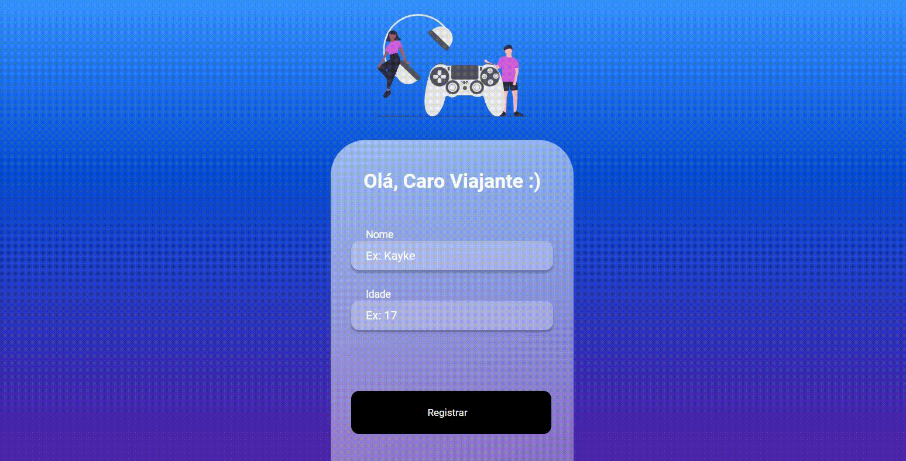

# MOBILE REGISTER



>  O projeto é um site mobile que registra o nome e a idade de algum usuário através do Front-End conectado como Back-End.
## :page_facing_up: Explicação

Fiz uma aplicação "Mobile Register" do curso Dev Club, que funciona com um sistema de registro que tem a opção de cadastrar novos usuários, mostrar todos usuários registrados e deletar um usuário em específico. 

Utilizei ReactJs na parte do Front-End e NodeJs (GET, POST e DELETE) na parte do Back-End. A estilização utilizei Styled Components.

## 📁 Páginas

O site tem no total 2 páginas, sendo elas:

- **Registro:** Página para registrar o usuário no site.
- **Usuários:** Página que mostra todos os uuários registrados.

## :dart: Etapas ##

Versão 1.0: :heavy_check_mark:

:heavy_check_mark: Criação da Rotas;\
:heavy_check_mark: Aplicação dos Estilos Globais;\
:heavy_check_mark: Componente Header e Footer;\
:heavy_check_mark: Consumo da API e Contexto da API;\
:heavy_check_mark: Página de Login e Registro;\
:heavy_check_mark: Página de Redefinição de Senha;\
:heavy_check_mark: Responsividade no Login, Registro e Redefinição;\
:heavy_check_mark: Aplicando os Produtos na Página Home;\
:heavy_check_mark: Páginas Men, Women, Jewelery e Eletronics;\
:heavy_check_mark: Consumindo API pela categoria;\
:heavy_check_mark: Página de Inspect e Our Policy;\
:heavy_check_mark: Carrinho de Compra no Header;\
:heavy_check_mark: Responsivo Footer;\
:heavy_check_mark: Página Search e Error 404;\
:heavy_check_mark: Validação dos Input com Yup;\
:heavy_check_mark: Header Fixo;\
:heavy_check_mark: Adicionando as avaliações nos produtos;\
:heavy_check_mark: Produtos adicionados no carrinho;\
:heavy_check_mark: Opções de loja no carrinho;\
:heavy_check_mark: Página de Entrega;\
:heavy_check_mark: Página de Pagamento;\
:heavy_check_mark: Carousel dos produtos na Home;\
:heavy_check_mark: Arrumando Erro do Carrinho quando estava vazio;\
:heavy_check_mark: Carousel com Banners na Home;\
:heavy_check_mark: Seção de parceiros na HOme;\
:heavy_check_mark: Autenticação com Firebase;\
:heavy_check_mark: Página de Donate;\
:heavy_check_mark: Vídeo do projeto;\
:heavy_check_mark: Finalizado 1.0;

## :rocket: Tecnologias ##

No projeto foram utilizadas as seguintes tecnologias:

- [ReactJs](https://pt-br.reactjs.org/)
- [React Router](https://v5.reactrouter.com/web/guides/quick-start)
- [Styled-Components](https://styled-components.com/docs)
- [NodeJs](https://nodejs.org/en/)

## :closed_book: Requisitos ##

Antes de iniciar :checkered_flag:, você precisa ter [Git](https://git-scm.com) e [Node](https://nodejs.org/en/) instalados.

## :checkered_flag: Começando ##

```bash
# Clone this project
$ git clone https://github.com/Kayke-Fujinaka/E-commerce
# Access
$ cd e-commerce
# Install dependencies
$ yarn or npm 
# Run the project
$ yarn start or npm start 
# The server will initialize in the <http://localhost:3000>
```

Precisa criar um sistema de Registro no Node.js, sendo eles: GET, POST e DELETE.

## 🤝 Colaboradores

Agradecemos às seguintes pessoas que contribuíram para este projeto:

<table>
  <tr>
    <td align="center">
      <a href="#">
        <br>
        <sub>
          <b>Kayke Fujinaka</b>
        </sub>
      </a>
    </td>
  </tr>
</table>

## 📝 Licença

Este projeto está sob licença. Consulte o arquivo [LICENSE](LICENSE.md) para obter mais detalhes.

&#xa0;

<a href="#top">Volte para o topo</a>
